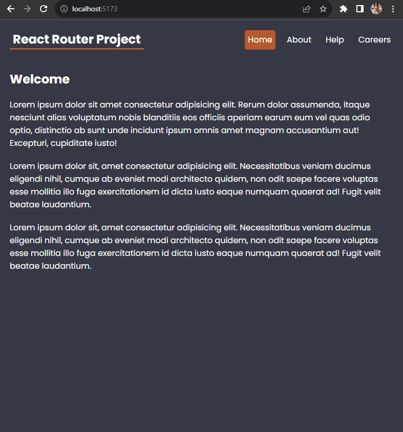

🔔 🔔 🔔
---
## About the project

This is the **react-router-project** exploring React Router library before and after v6.4. This library enables the creation of single-page applications with multiple views, allowing users to navigate between different parts of the application without causing a full page reload. React Router provides a declarative way to define the navigation structure of the application and efficiently manage the rendering of components based on the current URL.

 This project covers various concepts such as
- React Router Basics,
- RouterProvider,
- createBrowserRouter,
- Outlet,
- Nested Routes,
- Layouts,
- Custom 404 Page,
- Loaders,
- Route Parameters,
- Error Elements,
- Making Breadcrumbs (useLocation hook),
- Forms, and Actions.


The project's boilerplate was created using Vite.

## Project description

This project explores two options for working with a JSON file:

1. **JSON Server:**
   - The first option involves installing json-server module and running it using the command:
     ```
     npx json-server --watch data/db.json --port 4000
     ```
     This setup enables us to wrap the JSON file with API endpoints, allowing seamless interaction with `data/db.json` as if it were a REST API. This option was used during the development stage, but eventually, data was put into the Realtime Firebase Database.

2. **Realtime Firebase Database:**
   - The second option entails creating a Realtime Firebase Database. Data is imported from a JSON file, and necessary information is fetched from this remote database when required. The second option was chosen as the final implementation for this project.


**Example of content of db.json file:**
```
{
    "careers": [
      {
        "id": 1,
        "title": "Senior React Developer",
        "salary": 50000,
        "location": "London, UK"
      },

        ...

      {
        "id": 7,
        "title": "Food Tester",
        "salary": 30000,
        "location": "London, UK"
      }
    ]
  }

```

## Installation

1. Clone the repository or download the source code.

`git clone https://github.com/ElenaCoder/react-router-project`

3. Navigate to the right directory.

`cd react-router-project`

2. Install the dependencies.

`npm install`


## Usage

1. Start the development server.

`npm run dev`

2. This will start the development server, and you can view the React application in your web browser at http://localhost:5173.

## Deployment

This project is deployed and can be accessed at [this link:](https://elenacoder.github.io/react-router-project)

The deployment is done using GitHub Pages, which provides free hosting for static websites.

## Firebase Database Access Expiry

Please note that access to the Firebase database used in this project is set to expire on 2033-12-10. After this date, the database will no longer be accessible, and all associated data interactions will cease to function.


## Project preview

Explore a sneak peek of the React Router Project with this animated GIF showcasing key features and the user interface.



## License

This project is licensed under the MIT License.


---